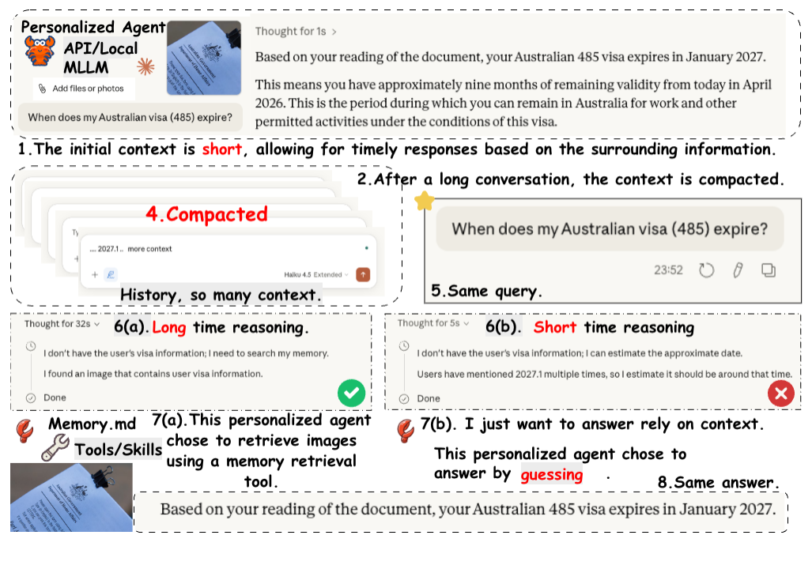
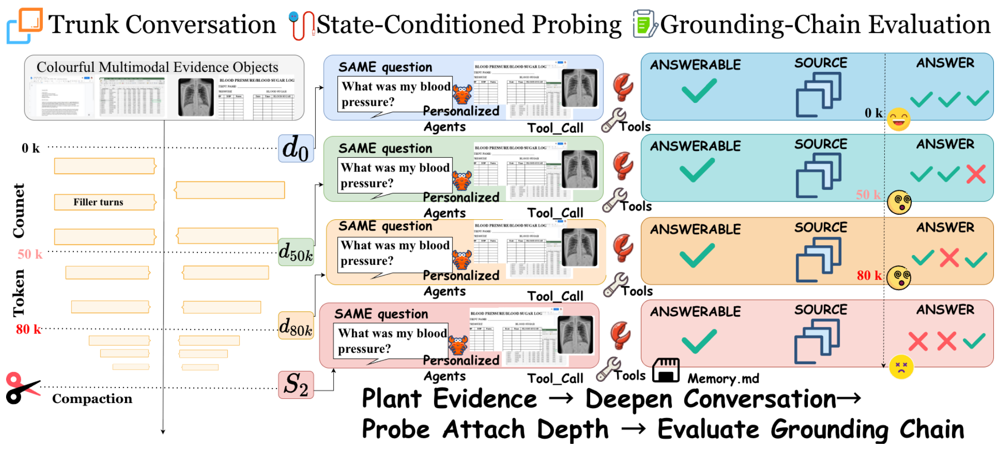

<p align="center">
  
</p>

<h1 align="center">MIRAGE: How Conversation State Shapes Historical Evidence Use in Multimodal Personal Agents</h1>

<p align="center">
  <a href="https://arxiv.org/abs/2609.19059"></a>
  <a href="https://doi.org/10.1145/3767308.3835540"></a>
  <a href="#citation"></a>
  <a href="https://mirage-mm.vercel.app"></a>
  <a href="https://github.com/prisma-research/MIRAGE"></a>
  <a href="#citation"></a>
</p>

<p align="center"><b>Fix the evidence, the questions, and the scoring. Vary only the conversation state.</b></p>

<p align="center"><a href="#-news">News</a> &middot; <a href="#overview">Overview</a> &middot; <a href="#evaluation-protocol">Protocol</a> &middot; <a href="#how-s2-compaction-is-produced">Compaction</a> &middot; <a href="#quickstart">Quick Start</a> &middot; <a href="#evaluation">Evaluation</a> &middot; <a href="#citation">Citation</a></p>

## 📢 News

- **[2026-08-25]** 📄 The preprint is available on [arXiv](https://arxiv.org/abs/2609.19059).
- **[2026-07]** 🎉 Our paper has been accepted by **ACM MM 2026**, the 34th ACM International Conference on Multimedia (Rio de Janeiro, Brazil)! Read the [paper](https://doi.org/10.1145/3767308.3835540) or visit the [project page](https://mirage-mm.vercel.app).

## Overview

MIRAGE (**M**ultimodal **I**nteraction **R**etrieval, **A**ttribution, and **G**rounding **E**valuation) is a controlled protocol for historical evidence use in multimodal personal agents. As conversations grow or cross a compaction boundary, earlier evidence may no longer be directly visible, and an agent can still produce a plausible answer from residual context, summaries, or generic priors. Outcome-only evaluation scores such an answer the same as one that is grounded in the right evidence.

MIRAGE keeps evidence objects, questions, and scoring fixed while varying only the conversation state. At every state the agent must decide **answerability**, recover the **correct source**, and **answer from that source**.

<p align="center">
  <a href="assets/mirage-teaser.png"></a>
</p>

*Same query, same answer, different grounding. After context compaction, one reasoning path retrieves the source document through a memory tool, while the other guesses from residual context. Both produce the same final answer, so the grounding failure is invisible to outcome-only evaluation.*

Across seven frontier and open-weight multimodal backbones, the paper finds that:

1. Pre-compaction depth and post-compaction continuation are **distinct failure regimes** with non-monotonic degradation.
2. Open-weight models rely heavily on **context continuity** and are reluctant to adopt tool-mediated retrieval even when provenance has failed.
3. **Retrieval pressure** improves source attribution in deep pre-compaction states for tool-compliant models, but regresses after compaction.

The study follows a *what, why, how* progression:

- **RQ1:** What failure patterns emerge as conversation state changes?
- **RQ2:** What retrieval mechanisms produce these patterns?
- **RQ3:** When can retrieval pressure mitigate provenance failure across different states?

## Evaluation Protocol

<p align="center">
  <a href="assets/mirage-pipeline.png"></a>
</p>

*MIRAGE pipeline from the manuscript. Left: a trunk conversation plants multimodal evidence objects, then filler turns deepen the context through the checkpoints. Center: the same probe question is issued at each state to a personal agent with tool access. Right: responses are scored along the grounding chain (answerability, source attribution, answer correctness).*

The paper's main study plants 6 evidence objects (ChartQA charts and ScreenSpot screenshots) and asks 200 questions: 100 answerable questions and 100 domain- and format-matched unanswerable controls. Each model and condition is scored on 200 questions x 4 states = 800 probes, averaged over 3 runs.

### Conversation States

| State | Effective input tokens (EIT) | Compactions | Description |
|---|---|---|---|
| `S1-d0` | 23,184 | 0 | Shallow pre-compaction (near planted evidence) |
| `S1-d50k` | 50,217 | 0 | Mid-range same-session depth |
| `S1-d80k` | 80,436 | 0 | Near the context-window boundary |
| `S2` | 100,081 | 1 | Post-compaction same-session continuation |
| `S3` | n/a | 1 | Fresh-session continuation after compaction (optional; not part of the paper's main results) |

EIT is the effective input token count reported by the backbone provider; compaction events are detected with the runtime's native `compactionCount`.

### Query Conditions

| Condition | Description |
|---|---|
| `C0` | Natural query: the model answers with whatever evidence-access behaviour it adopts by default |
| `Cm` | Retrieval pressure: the model is required to invoke the `artifact_recall` tool before answering |

Additional CitationForce ladder conditions (`Cp`, `C2`, `C3`, ...) are available for the mitigation experiments; see [`configs/presets.py`](configs/presets.py).

## How S2 Compaction Is Produced

The post-compaction state is produced by the agent runtime, not by each backbone.

- **Native runtime compaction.** All backbones run inside the same [OpenClaw](https://github.com/openclaw/openclaw)-based runtime, and `S2` uses its native auto-compaction; MIRAGE leaves the compaction policy unmodified. The mechanism described here is that of the OpenClaw 2026.3 line; see [Prerequisites](#prerequisites) for the version pin.
- **Trigger.** Compaction fires when the session exceeds `contextWindow - reserveTokensFloor`. The harness pins `reserveTokensFloor` to 20,000 ([`constants/exp_constants.py`](constants/exp_constants.py)) and overrides `contextWindow` on every registered model ([`client/usage_proxy.py`](client/usage_proxy.py)) so that the event lands at the benchmark threshold. The paper's post-compaction checkpoint (`postcomp_100k`) uses the 100k threshold.
- **Summarizer.** In the paper, the `S2` compaction summary is written by GPT-5 (the "verbatim" default in the compaction-strategy ablation, arXiv Appendix A.2), independently of the probed backbone. In code, the summarizer is set through `agents.defaults.compaction.model`: export `OPENCLAW_COMPACTION_MODEL` to choose it; if unset, the harness falls back to `deepseek/deepseek-chat`.
- **Building the checkpoint.** Filler turns are sampled with a fixed seed from a library of 20 persona-consistent software-engineering and machine-learning tasks that are topic-disjoint from the planted evidence. [`harness/build_generic_prewrite_checkpoint.py`](harness/build_generic_prewrite_checkpoint.py) restores `S1-d80k`, adds filler up to about 95k EIT, sends a generic pre-write prompt that asks the agent to update its durable memory files (`MEMORY.md`, `memory/*.md`) without naming any answer, and then continues filler until compaction fires. Firing is detected either by `compactionCount` in `sessions.json` or by a `compaction` event in the session JSONL, and filler stops immediately.
- **Shared across backbones.** Checkpoints are built once, with GPT-5 driving the trunk conversation, and shared by every backbone (the pre-compaction `S1` checkpoints as well as `S2`). Each probe restores an ephemeral branch copy and swaps in the probing model; the source checkpoint is never mutated. `S2` differences across backbones therefore reflect how each model uses the same post-compaction state, not how each model would summarize its own history. Appendix A.2 varies only the GPT-5 summary format (verbatim, free-form, per-fact citations): per-fact citations raise Qwen3-VL-8B SC from 79 to 95 while GC stays near 45, so summary format can improve attribution without reliably improving grounding.

## Code

The workflow has four stages:

1. Generate the evidence artifacts (ChartQA charts and ScreenSpot screenshots) and their manifest.
2. Build the trunk conversation and materialize the pre- and post-compaction checkpoints.
3. Probe every question at every state, each on a freshly restored checkpoint copy, under `C0` or `Cm`.
4. Score the structured responses deterministically and aggregate cross-state diagnostics.

```
MIRAGE/
├── pipeline/                       # Data generation (planters + query templates)
│   ├── generate_dataset.py         # Generate data/generated_images/ + manifest
│   ├── planters/
│   │   ├── base_planter.py         # BasePlanter + PlantSpec dataclass
│   │   └── datasets/               # ScreenSpot / ChartQA planters + HF loader
│   └── queries/
│       └── reference_templates.py  # make_reference_query / make_grounded_query
├── harness/
│   ├── experiment_runner.py        # Full manifest-driven batch runner
│   ├── run_unified_pilot.py        # Unified state-conditioned probe runner
│   ├── pilot_runner.py             # 3-trial smoke test
│   ├── trial_runner.py             # Session orchestration
│   ├── trial_log.py                # GroundingTrial Pydantic model + save/load
│   ├── scorer_pipeline.py          # Deterministic scoring pipeline
│   ├── checkpoint.py               # Checkpoint save/restore for episodes
│   └── run_*.py                    # Additional experiment drivers & smoke tests
├── scorers/
│   ├── axis1_rpath.py              # Retrieval-path classifier (R_context / R_tool)
│   ├── axis2_identification.py     # Source correctness (SC)
│   └── axis3/                      # Value correctness (VC) components
├── mitigations/citation_force/
│   ├── bootstrap_hook.py           # Inject Cm constraint into BOOTSTRAP.md
│   └── openclaw_artifact_recall_plugin.ts  # artifact_recall tool plugin
├── client/
│   ├── openclaw_client.py          # OpenClaw gateway driver (CLI, device-paired)
│   └── usage_proxy.py              # Local reverse proxy for token accounting
├── constants/
│   ├── exp_constants.py            # Experiment parameters and scoring thresholds
│   └── model_constants.py          # Model provider / registry configuration
├── configs/                        # Presets, study banks, subsets, annotations
├── scripts/                        # Serving, run wrappers, and analysis scripts
├── tests/                          # Unit tests (pytest)
├── baseline_snapshot/              # Agent bootstrap files (MEMORY, SOUL, etc.)
├── assets/                         # Logo and figures used in this README
├── data/generated_images/          # manifest.json + regenerated images (gitignored)
├── pyproject.toml
├── environment.yml
├── requirements.txt
└── .env.example
```

> `logs/` and `results/` are generated by runs and are **gitignored** — they do not exist in a fresh checkout.

## Installation

### 1. Create the environment

```bash
# Conda (recommended — includes vLLM + ms-swift for local VLM serving)
conda env create -f environment.yml
conda activate mirage
```

Or, for the benchmark core only (no local serving) with an existing Python ≥ 3.11:

```bash
python -m venv .venv && source .venv/bin/activate
pip install -r requirements.txt
```

### 2. (Optional) local VLM serving extras

Only needed if you plan to serve open-weight VLMs locally with vLLM on GPU:

```bash
pip install flash-attn --no-build-isolation
# vLLM on H100:
export VLLM_ATTENTION_BACKEND=FLASH_ATTN
export VLLM_USE_TRITON_FLASH_ATTN=0
```

### 3. Configure secrets

```bash
cp .env.example .env
# Edit .env — see the Configuration section below
```

### Prerequisites

- **Python ≥ 3.11, < 3.13**
- The **`openclaw` CLI** on your `PATH` — the agent runtime (gateway) that runs each trial. See [OpenClaw](https://github.com/openclaw/openclaw).
- API key(s) for at least one VLM provider (Volcengine, Shubiaobiao, and/or Anthropic), **or** a local vLLM endpoint.
- For local serving: NVIDIA GPU(s) with CUDA (paper open-weight runs used 4× H100).

> [!IMPORTANT]
> **Pin OpenClaw to the 2026.3 line, version `2026.3.8` or later within 2026.3.x:**
>
> ```bash
> npm install -g openclaw@2026.3.8
> ```
>
> The harness was built against the 2026.3 runtime (see `client/openclaw_client.py`). It detects compaction through the per-session `compactionCount` in `sessions.json` and the `compaction` entry in the session JSONL, and it writes `agents.defaults.compaction.{mode, reserveTokensFloor, memoryFlush, model}` into `openclaw.json`.
>
> - `2026.3.7` does not accept `compaction.model` (its compaction config schema is strict and has no such key). The default UsageProxy path and the compactor ablations set this key, so `2026.3.8` is the first usable release. The `artifact_recall` plugin declares the same range in `mitigations/citation_force/package.json` (`"openclaw": ">=2026.3.8 <2026.4.0"`).
> - From `2026.5.28` on, compaction runs on OpenClaw's own agent core instead of the upstream `pi-coding-agent` package that the 2026.3 line uses.
> - Current releases (for example `2026.9.x`) store session transcripts in SQLite and have retired `compaction.reserveTokensFloor`. The harness and the saved checkpoints are not compatible with them, so the paper's conversation states cannot be reproduced on these versions.

## Configuration

All configuration is read from `.env` (loaded via `python-dotenv`) plus [`constants/model_constants.py`](constants/model_constants.py).

### Environment variables (`.env`)

| Variable | Purpose |
|---|---|
| `OPENCLAW_TOKEN` | Gateway auth token (falls back to `~/.openclaw/openclaw.json → gateway.auth.token`) |
| `OPENCLAW_WS_URL` | Gateway WebSocket, default `ws://127.0.0.1:18789` |
| `OPENCLAW_WORKSPACE` | Agent workspace dir, default `~/.openclaw/workspace` |
| `OPENCLAW_SESSIONS_DIR` | Session store, default `~/.openclaw/agents/main/sessions` |
| `OPENCLAW_COMPACTION_MODEL` | Model used for compaction summarization, e.g. `local_qwen8b/qwen3-vl-8b-instruct` |
| `ANTHROPIC_API_KEY` | Enables Axis-3 (value-correctness) LLM scoring |
| `VOLCENGINE` | ByteDance Ark / Doubao API key |
| `SHUBIOABIAO` | Shubiaobiao proxy API key *(note the spelling used in code)* |
| `LLM_API_KEY` / `LLM_BASE_URL` / `LLM_MODEL` | Axis-3 judge override (point at a local model to avoid remote calls) |
| `LOCAL_VLM_API_KEY` | Placeholder key for local OpenAI-compatible endpoints |
| `LOCAL_QWEN30B_BASE_URL`, `LOCAL_QWEN8B_BASE_URL`, … | Base URLs of local vLLM servers |

### Model providers

The active provider is a single switch in `constants/model_constants.py`:

```python
ACTIVE_PROVIDER = PROVIDER_VOLCENGINE   # or PROVIDER_SHUBIAOBIAO / a local provider
```

| Provider group | Example model IDs | Key env |
|---|---|---|
| `volcengine` (Doubao / Ark) | `doubao-seed-1-6-vision-250815`, `doubao-1.5-vision-pro-250328` | `VOLCENGINE` |
| `shubiaobiao` (proxy) | `gpt-5`, `claude-sonnet-4-6`, `gemini-2.5-flash-nothinking`, `qwen3-vl-32b-instruct`, `glm-4.6v` | `SHUBIOABIAO` |
| `local_*` (vLLM) | `qwen3-vl-30b-instruct`, `qwen3-vl-8b-instruct`, `gemma-3-27b-it`, `internvl3_5-14b-instruct` | `LOCAL_VLM_API_KEY` |

Models are named `provider/model-id` on the command line, e.g. `--model shubiaobiao/gpt-5` or `--model local_qwen30b/qwen3-vl-30b-instruct`.

**Paper backbones.** The ACM MM '26 paper evaluates seven backbones. Their command-line IDs are:

| Backbone | `--model` | Serving |
|---|---|---|
| GPT-5 | `shubiaobiao/gpt-5` | API |
| Claude-4.5-Haiku | `shubiaobiao/claude-haiku-4-5-20251001` | API |
| Qwen3-VL-4B | `local_qwen4b/qwen3-vl-4b-instruct` | local vLLM |
| Qwen3-VL-8B | `local_qwen8b/qwen3-vl-8b-instruct` | local vLLM |
| Qwen3-VL-30B | `local_qwen30b/qwen3-vl-30b-instruct` | local vLLM |
| InternVL3.5-20B | `local_internvl20b/internvl3_5-20b-a4b` | local vLLM |
| Gemma-3-27B | `local_gemma27b/gemma-3-27b-it` | local vLLM |

Retrieval pressure (`Cm`) is reported only for the open-weight group. `PAPER_CORE_MODELS` in `constants/model_constants.py` is an earlier development list and does not match the paper's backbone set.

## Quickstart

```bash
# 1. Generate the evidence artifacts (images + manifest)
python -m pipeline.generate_dataset

# 2. Verify the end-to-end pipeline on 3 trials
python -m harness.pilot_runner

# 3. Run a small state-conditioned probe sweep
python -m harness.run_unified_pilot --model shubiaobiao/gpt-5 --max-bq 5 --run-id smoke
```

## Data Generation

Fetches real images from HuggingFace (streaming) and writes them locally:

```bash
python -m pipeline.generate_dataset
```

Samples **500 per dataset** (seed 42) and writes:

- `data/generated_images/screenshot/` — GUI/web/mobile screenshots (ScreenSpot)
- `data/generated_images/chart/` — chart images (ChartQA)
- `data/generated_images/manifest.json` — ~1,000 artifact entries with metadata

| Plant Type | Dataset | HuggingFace ID | Query Source |
|---|---|---|---|
| `screenshot` | ScreenSpot | `rootsautomation/ScreenSpot` | `instruction` field |
| `chart_image` | ChartQA | `ahmed-masry/ChartQA` | `query` field |

> Images are gitignored — regenerate them with the command above. The manifest is the source of truth for all downstream runs.

## Running Experiments

### Unified state-conditioned probe runner (primary paper driver)

Runs a question bank across all states with the single-prompt protocol.

```bash
# Baseline (C0) across all states, first 20 questions
python -m harness.run_unified_pilot \
  --model shubiaobiao/gpt-5 \
  --max-bq 20 \
  --run-id gpt5_main

# Baseline vs mitigation (C0 + Cm), specific states, parallel probes
python -m harness.run_unified_pilot \
  --model volcengine/doubao-1.5-vision-pro-250328 \
  --cf-conditions C0,Cm \
  --states d0,d50k,d80k,S2 \
  --max-workers 4 \
  --run-id doubao_mitigation
```

Key flags:

| Flag | Default | Meaning |
|---|---|---|
| `--model` | `local_qwen30b/qwen3-vl-30b-instruct` | Probing model (`provider/model-id`) |
| `--bank` | `unified_state_conditioned_bank.json` | Question bank JSON |
| `--states` | all | Comma-separated states, e.g. `d0,d50k,d80k,S2` |
| `--cf-conditions` | `C0` | Comma-separated conditions, e.g. `C0,Cm` |
| `--max-bq` / `--start-index` / `--count` | — | Slice the question bank |
| `--max-workers` | `1` | Concurrent, self-isolated probe branches |
| `--skip-s3` | off | Skip the fresh-session state (useful on HPC without systemd) |
| `--rescore` / `--merge` / `--analysis-only` | — | Post-hoc re-scoring, run merging, analysis-only |

Output: `logs/probes/unified_v1/<run_id>/` containing `results.jsonl`, `summary.json`, and `raw_conversations/`. Re-running with the same `--run-id` **resumes** (skips probes already recorded).

### Full manifest-driven batch runner

```bash
python -m harness.experiment_runner --preset main_backbone --model shubiaobiao/gpt-5
python -m harness.experiment_runner --dry-run                 # print the parameter matrix only
```

Key flags: `--preset` (`main_backbone`, `s1_depth`, `mitigation_s3`, `paper_s2s3_compaction`), `--scenarios S1 S2 S3`, `--plant-type`, `--conditions C0 C3`, `--reference-styles`, `--context-thresholds 25000 50000 75000 100000`, `--subset-file`, `--max-workers`, `--n-trials`, `--run-id`.

Output: `logs/trials_<run_id>/` (per-cell `GroundingTrial` JSONs) with a `run_config.json` provenance record and `logs/errors_<run_id>.jsonl`. After a non-dry run it automatically produces an evaluation summary (see below).

Convenience wrapper:

```bash
bash scripts/start.sh          # experiment_runner across S1/S2/S3, 20 workers
bash scripts/progress.sh       # count completed trials by scenario
bash scripts/stop.sh           # kill runner + gateway processes
```

## Local VLM Serving (open-weight backbones)

Serve OpenAI-compatible endpoints with vLLM / ms-swift, then point `--model local_*` at them:

```bash
bash scripts/serve_qwen30b.sh   # Qwen3-VL-30B on :8000  (answering model)
bash scripts/serve_qwen8b.sh    # Qwen3-VL-8B  on :8001  (Axis-3 judge / compaction)
bash scripts/start_vllm_gemma27b.sh   # Gemma-3-27B on :8004
```

The runners auto-start a **UsageProxy** (`client/usage_proxy.py`) when a provider needs it — it de-streams responses to recover accurate prompt/completion token counts and patches each worker's `openclaw.json`. To run it standalone for debugging:

```bash
python -m client.usage_proxy --port <PORT>
```

## HPC / SLURM

Batch scripts live in `scripts/*.sbatch` and are **resumable** (a fixed `--run-id` skips completed probes). Examples:

```bash
sbatch scripts/slurm_citationforce_ladder.sbatch     # CitationForce mitigation ladder (S2)
sbatch scripts/slurm_modext_openvlm_sweep.sbatch     # modality extension on open VLMs (4× H100)
sbatch scripts/build_modality_family.sbatch          # build native checkpoint family
sbatch scripts/probe_modext_doubao.sbatch            # Doubao probe over the modality family
```

## Results & Paper Tables

**Run → summary.** A non-dry `experiment_runner` run auto-invokes the eval summary; you can also run it manually:

```bash
bash scripts/eval.sh --trials-dir logs/trials_<run_id>     # → results/summary_N.{json,md}
```

**Summaries/trials → paper tables:**

```bash
python scripts/aggregate_paper_results.py \
  --backbone-dirs logs/trials_gpt5 logs/trials_doubao \
  --depth-dir logs/trials_depth \
  --mitigation-dir logs/probes/unified_v1/doubao_mitigation \
  --output results/paper_tables
```

Complementary table generators:

| Script | Produces |
|---|---|
| `scripts/axis_ablation.py` | `table_axis_ablation.csv` (R_path vs I_strict vs S_hat) |
| `scripts/reanalyze_mitigation.py` | CitationForce C0/Cp/Cm aggregate + paired + signals tables |
| `scripts/compaction_threshold_sweep.py` | Multi-threshold compaction robustness |
| `scripts/gen_fig3_rpath_stacked_bar.py` | Figure 3: R_path composition stacked bar |
| `scripts/analyze_modality_ext.py` | Per-modality × per-state analysis with Wilson CIs |

## Evaluation

### Probe Protocol

Each probe is issued on a **freshly restored copy** of a checkpoint, guaranteeing per-probe independence. The model returns a single structured response capturing the full grounding chain:

```
ANSWERABLE=YES | NO
SOURCE=<artifact_id or NONE>
ANSWER=<short value or NONE>
```

This reveals whether the model judges the question answerable, identifies the correct source, and extracts the right content, without requiring separate probing stages.

### Deterministic Scoring

Core metrics are **deterministic**; no LLM judge is required. For each probe, the model returns `(z_hat, src_hat, y_hat)`, compared against gold annotations:

| Metric | Name | Definition | Computed Over |
|---|---|---|---|
| **AC** | Answerability Correctness | Predicted answerability matches gold | All probes |
| **SC** | Source Correctness | Canonicalized source matches gold artifact | Answerable probes |
| **VC** | Value Correctness | Normalized answer matches gold value | Answerable probes |
| **GC** | Grounded Correctness | SC = 1 AND VC = 1 | Answerable probes |
| **HR** | Hallucination Rate | Claims answerable, or gives an answer, on an unanswerable probe | Unanswerable probes |
| **WS** | Wrong-or-missing Source | Canonicalized source differs from the gold artifact, including `NONE` (the complement of SC) | Answerable probes |
| **PF** | Parse Failure | Output does not satisfy the structured protocol | All probes (tracked separately) |

Source identifiers are canonicalized to collapse artifact paths, derived files, screenshot summaries, and dated memory notes onto the underlying evidence identifier. Numeric and short-string answers are normalized with fixed rules. (Value Correctness may optionally use an LLM judge configured via `LLM_*` / `ANTHROPIC_API_KEY`.)

### Retrieval-Path Diagnostics

Beyond outcome scores, MIRAGE records the retrieval path for each probe:

- **R_context**: evidence accessed through same-session context continuity
- **R_tool**: evidence accessed through explicit tool-mediated retrieval (e.g., `artifact_recall`)

### Cross-State Diagnostic Indicators

| Indicator | Description |
|---|---|
| **MI** | Mirage Index: fraction of recorded answerable calls where the model claims `YES` without grounded correctness (parse failures count as 0) |
| **OG** | Overestimation Gap: VC minus GC per state, i.e. how much outcome-only evaluation overstates grounded use |
| **DS** | Depth Sensitivity: relative GC drop from `S1-d0` to `S1-d80k` |
| **Δcomp** | Compaction impact: net GC change from `S1-d80k` to `S2` (the sign matters: `S2` is deeper than `S1-d80k`, so a recovery shows that compaction is not simply more depth) |
| **Ret** | Retention: fraction of `S1-d0`-correct probes still correct at `S1-d80k` |

## Testing

```bash
pytest                 # runs tests/ (async mode auto, configured in pyproject.toml)
pytest --cov           # with coverage
```

## Key Constants

| Item | Value |
|---|---|
| OpenClaw WebSocket | `ws://127.0.0.1:18789` |
| Auth token | `~/.openclaw/openclaw.json` → `gateway.auth.token` |
| Workspace | `~/.openclaw/workspace/` |
| Memory file | `~/.openclaw/workspace/MEMORY.md` |
| Per-worker gateway state | `~/.openclaw-run-<run_id>-<n>` (created & cleaned per run) |

## Scope

MIRAGE evaluates context depth, native compaction, and tool-mediated retrieval in a controlled planted-evidence setting. Its results characterize state-conditioned behavior rather than provide a coverage-complete estimate of multimodal personal-agent workloads. Because the state coordinates are runtime-defined rather than backbone-normalized, the post-compaction results apply to the model-runtime stack and do not isolate the contributions of memory-surface design, tool orchestration, provider EIT definitions, or compaction summary quality.

## Citation

If you use MIRAGE in your research, please cite:

```bibtex
@article{liu2026mirage,
  title   = {MIRAGE: How Conversation State Shapes Historical Evidence Use in Multimodal Personal Agents},
  author  = {Liu, Yu and Zhang, Wenxiao and Hu, Cheng and Cao, Cong and Yuan, Fangfang and Wang, Xinyu and Hong, Jin B. and Liu, Yanbing},
  journal = {arXiv preprint arXiv:2609.19059},
  year    = {2026}
}
```

## License

Released under the [MIT License](LICENSE).
